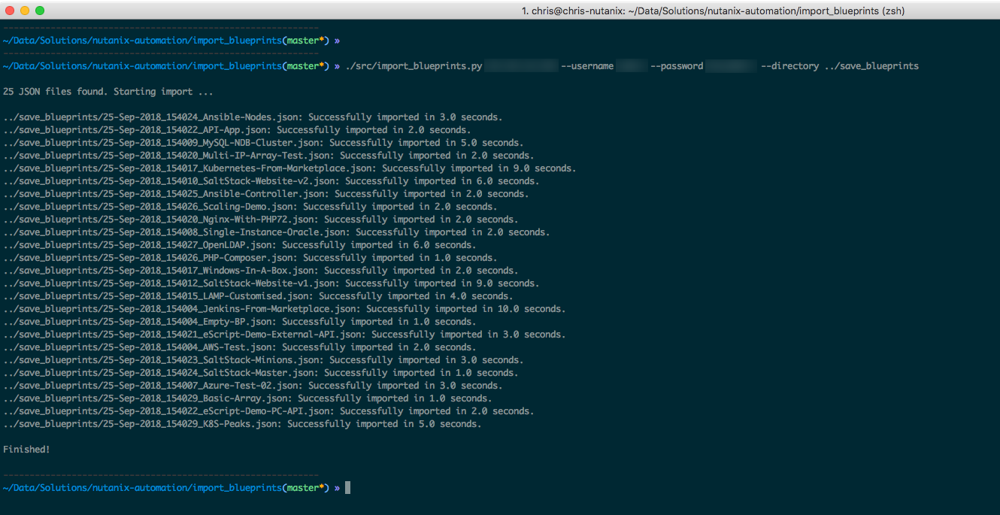

Import Calm Blueprints
======================

Python 3.6 script to connect to Prism Central 5.9 or above, get all JSON files from a specified directory and attempt to import them as new Calm blueprints (with appropriate error checking).

Note: Even though this script was written and tested against Prism Central 5.9, it should work without issue with 5.8.x, too.

Disclaimer
----------

This is *not* a production-grade script.  Please make sure you add appropriate exception handling and error-checking before running it in production.  See note re versions below, too.

Author
------

Chris Rasmussen, Solutions Architect, Nutanix (Melbourne, AU)

Changelog
---------

- 2018.09.25 - Script created

Details
-------

Connect to Prism Central 5.9 or above, get all JSON files from a specified directory and attempt to import them as new Calm blueprints (with appropriate error checking).

The intention is to use this script to re-import the blueprints you exported using `save_blueprints.py` (also available in this repo), without the need to manually import each one individually.

**Note**: You WILL need to manually fix the credentials for each blueprint after it has been imported.  For security reasons passwords are not exported with the JSON files.

**Note**: The 'default' project is used for all imports!

The other idea is for you, the user, to take this script and modify it to suit your requirements.

Requirements
------------

- Python3.6
- pip3 (to install requirements below, if you need to)
- requests
- urllib3
- pipenv (optional, but recommended)

Script Usage (Linux)
----------------------

::

    ./src/import_blueprints.py <prism_central_ip_address> [ --username username ] [ --password password --directory json_directory ]

Screenshot
----------

Support
-------

These scripts are *unofficial* and are not supported or maintained by Nutanix in any way.

In addition, please also be advised that these scripts may run and operate in a way that do not follow best practices.  Please check through each script to ensure it meets your requirements.

**Changes will be required before these scripts can be used in production environments.**
