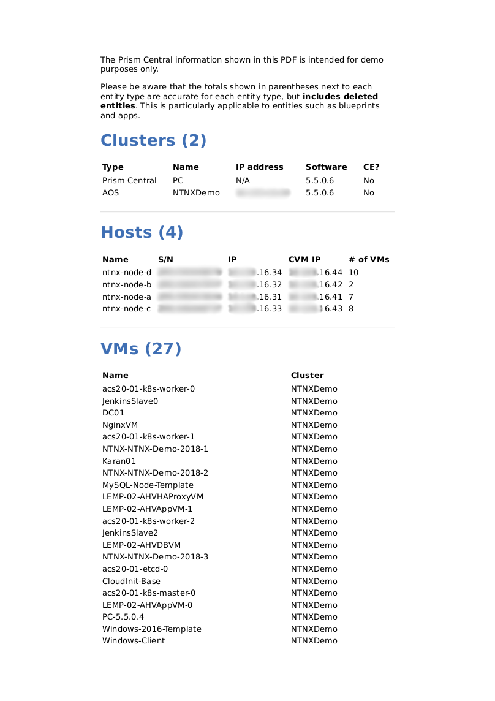

Nutanix Cluster Info
====================

"As-built" documentation script for use with Nutanix Prism Central 5.5.0.6 or later.

Disclaimer
----------

This is *not* a production-grade script.  Please make sure you add appropriate exception handling and error-checking before running it in production.  See note re versions below, too.

Author
------

Chris Rasmussen, Solutions Architect, Nutanix (Melbourne, AU)

Changelog
---------

- 2018.07.21 - Added better parameter input and options
- 2018.04.22 - Updated with installation and usage instructions for Windows 10 64-bit
- 2018.04.04 - Published version based on Prism Central and v3 API
- 2017.09.06 - Published new version based on Python 3

Details
-------

Connect to a Nutanix Prism Central instance, grab some high-level details then generate a PDF from it.

The intention is to use this script to generate very high-level and *unofficial* as-built documentation.

The other idea is for you, the user, to take this script and modify it to suit your requirements.

Requirements (new/Weasy-based version - Easy)
---------------------------------------------

**Ubuntu 16.04 (LTS)**

::

    sudo apt-get -y update
    sudo apt-get install -y libxml2-dev libxslt-dev libffi-dev libcairo2-dev libpango1.0-dev python3-dev python3-pip
    pip3 install --upgrade pip
    pip3 install requests
    pip3 install urllib3
    sudo pip3 install weasyprint

**OS X**

Install [HomeBrew](https://brew.sh/):

::

    /usr/bin/ruby -e "$(curl -fsSL https://raw.githubusercontent.com/Homebrew/install/master/install)"
    brew install python3 cairo pango gdk-pixbuf libffi
    pip3 install urllib3 requests weasyprint

**Windows 10 (64-bit!)**

- Install [Python3 using the Windows x86-64 executable installer](https://www.python.org/downloads/windows/).  My installation filename was python-3.6.5-amd64.exe.
- Add the Python binary directories to your PATH and disable the PATH length limit, when prompted.  During my testing, the Python binary path was c:\Users\nutanix\AppData\Local\Programs\Python\Python36\.
- For ease of use, add the pip3 binary directory to your PATH.  During my testing, this directory was C:\Users\nutanix\AppData\Local\Programs\Python\Python36\Scripts.
- Install [Git using 64-bit Git for Windows Setup](https://git-scm.com/download/win).  My installation filename was Git-2.17.0-64-bit.exe.
- Upgrade pip, if required:

::

    python -m pip install --upgrade pip

- Install required Python libraries:

::

    pip3 install requests
    pip3 install urllib3
    pip3 install weasyprint

Note: During testing, combining the 3 libraries above into a single install command seemed to produce strange results.  For this reason, I have listed the installation of each library as a separate command.

- If there is a message in the output specifying a directory to add to your PATH, make sure that's done before continuing
- Install [GTK for Windows](https://github.com/tschoonj/GTK-for-Windows-Runtime-Environment-Installer/releases) to C:\gtk.  My installation filename was gtk3-runtime-3.22.28-2018-03-12-ts-win64.exe.
- Add c:\gtk and c:\gtk\bin to your PATH
- Install [lxml](https://www.lfd.uci.edu/~gohlke/pythonlibs/#lxml).  Make sure you install the correct version for your system.  My installed filename was lxml‑4.2.1‑cp36‑cp36m‑win_amd64.whl (change the filename in the command below, if you use a different version)

::

    pip install lxml‑4.2.1‑cp36‑cp36m‑win_amd64.whl

- Install [pycairo](https://www.lfd.uci.edu/~gohlke/pythonlibs/#pycairo).  Make sure you install the correct version for your system.  My installation filename was pycairo‑1.16.3‑cp36‑cp36m‑win_amd64.whl (change the filename in the command below, if you install a different version)

::

    pip install pycairo‑1.16.3‑cp36‑cp36m‑win_amd64.whl

**Note you may need to reboot for the PATH changes to take effect**

Script Usage (General)
----------------------

There are a number of global options that can be set in this script.

- Set DISPLAY_OUTPUT to True to show detailed output for each entity type (only useful when running this script interactively)
- Set ENTITY_RESPONSE_LENGTH to the number of entities to retrieve for each request.  Use with caution as some entities are hard-limited to 50 results per request.

Script Usage (Ubuntu 16.04 LTS)
-------------------------------

::

    /usr/bin/python3 nutanix-cluster-info.py

Script Usage (OS X)
-------------------

::

    /usr/local/bin/python3 nutanix-cluster-info.py

Script Usage (Windows 10)
-------------------------

- Make sure you are in the directory containing `nutanix-cluster-info.py`
- Run the script:

::

    python nutanix-cluster-info.py

- Ignore any warnings about @font-face not being supported on Windows for now
- If you get a prompt asking for the Prism Central IP address, everything is working

Custom Templates
----------------

Included with this script is an HTML file called 'templates/nutanix.html'.

**Summary**

The repo includes 'templates/nutanixv3.html', an HTML5 document containing a sample layout that can be used with this script.  If you want to modify the generated PDF's content or layout, edit templates/nutanixv3.html to suit your requirements.

**Available Fields**

Please make sure the file is saved as 'templates/nutanixv3.html' when you are finished._

As of the current release, the required fields in templates/nutanix.html are as follows (all are to be prefixed with a '$' symbol, as shown):

- $clusters                   [ The list of clusters visible from your PC instance ]
- $hosts                      [ The hosts visible from your PC instance ]
- $vms                        [ The VMs managed by your PC instance ]
- $subnets                    [ The subnets managed by your PC instance ]
- $projects                   [ List of projects managed by your PC instance ]
- $apps                       [ List of Calm apps managed/deployed by your PC instance ]
- $blueprints                 [ List of available calm blueprints in your PC instnace ]
- $network_security_rules     [ List of Flow network security rules managed by your PC instance ]
- $images                     [ List of images available via your PC instance ]
- $day                        [ The date this script was run ]
- $now                        [ The time this script was run ]
- $username                   [ The username of the current logged-in user ]
- $computer_name               [ The current local computer name ]

**PDF Formatting**

As of version 2.0, this script uses 'WeasyPrint' for PDF generation.  Please see the [WeasyPrint docs](http://weasyprint.readthedocs.io/en/latest) for detailed information on the available formatting options.

Screenshot
----------

This is what the PDF looks like, once generated.

Support
-------

These scripts are *unofficial* and are not supported or maintained by Nutanix in any way.

In addition, please also be advised that these scripts may run and operate in a way that do not follow best practices.  Please check through each script to ensure it meets your requirements.

**Changes will be required before these scripts can be used in production environments.**